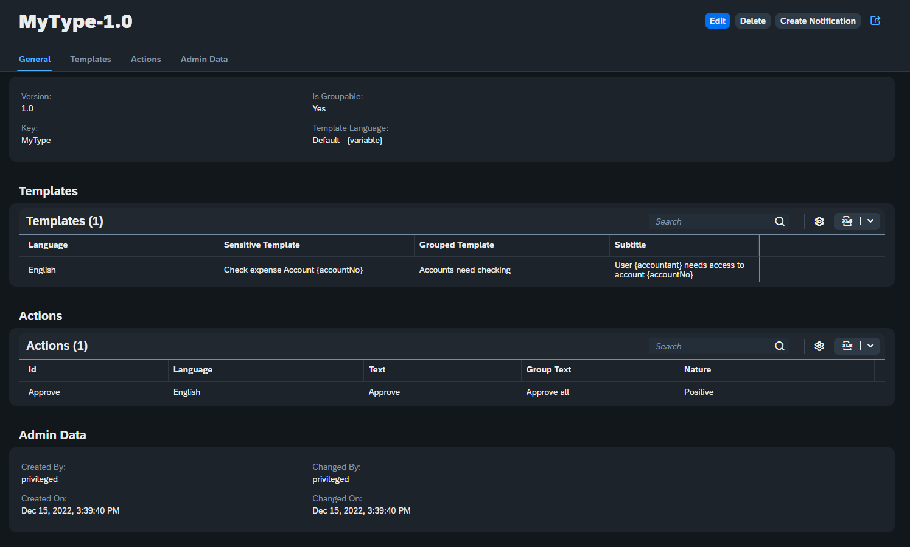
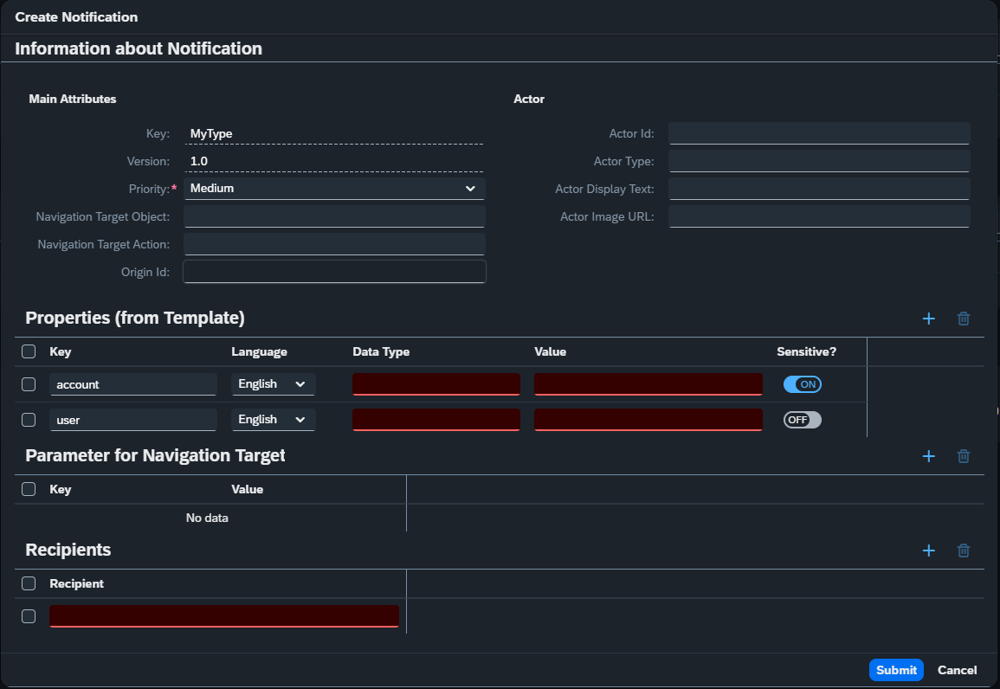

# Admin Service/UI for SAP Launchpad Notification Service

Project to allow an easier maintenance of notification types for the SAP Launchpad Notification Service (see [here](https://help.sap.com/docs/Launchpad_Service/8c8e1958338140699bd4811b37b82ece/fe40c015d2b24487945f4b40ed86534e.html?locale=en-US)).

This project adds the following capabilities to the Notification service.

- UI for easy maintenance -> enable business users
- Easy synchronization of existing entries from the notification service
  > **Note**: Only the main properties of the notification types can be synced to the local HANA storage as information on *Templates* and *Actions* can not be retrieved via the SAP Launchpad Notification service.

## Features

### Backend

Backend consists of a simple CAP application which persists the notification types to a SAP HANA Cloud database.

### User Interface

Easy to use Fiori Elements application with draft capabilities to maintain notification types for SAP Launchpad Notification Service. Saving or deleting an entity triggers the synchronization to the notification service



Allows for direct testing of the notification type by creating a notification


## Usage

### Preconditions

- Existing SAP BTP Subaccount with the following entitlements:
  | Service                                    | Plan                  |
  | ------------------------------------------ | --------------------- |
  | Authorization and Trust Management Service | application           |
  | SAP HANA Schemas & HDI Containers          | hdi-shared            |
  | Destination Service                        | lite                  |
  | HTML5 Application Repository Service       | app-host, app-runtime |

- Cloud Foundry Environment is enabled in the subaccount
- Space is created
- SAP HANA Cloud Database exists in space or is shared

### Deployment

- Logon to subaccount space with authorized user via Cloud Foundry CLI
- Run command `npm i` in shell
- Run command `npm run build` in shell
- Run command `npm run deploy` in shell

### Manual Steps after Deployment

1. Assign role collection `NotificationTypesAdmin` to users who need access to the application
2. Add the application "Manage Notification Types" to a SAP Launchpad Service Site

### Configuration of SAP Launchpad Notification Service

1. Subscribe to SAP Launchpad Service
2. Navigate to Launchpad Landing Page
3. Enable Notifications in the settings section
4. Create a destination with the notification service credentials in your subaccount named `SAP_Notifications` (see [here](https://help.sap.com/docs/Launchpad_Service/8c8e1958338140699bd4811b37b82ece/d5429a2a5d9a4425a461aa06c4ee84e4.html?locale=en-US#configure-the-destination-to-the-notifications-service)).

## Local Setup for `husky`

Run `npx husky install` to install git hooks

## Configure `.env` file for VS Code REST API tests

Template for `.env` file

```properties
# variables communication with the launchpad notification service
authUrl=
notifUrl=
notifClientId=""
notifClientSecret=""

# email for notification receiver - i.e. the user who loggs into the launchpad site
recipientEmail=

# English properties for notification type template
TemplateSensitive=
TemplateGrouped=
TemplatePublic=
Subtitle=

# German properties for notification type template
TemplateSensitive_de=
TemplateGrouped_de=
TemplatePublic_de=
Subtitle_de=
```
